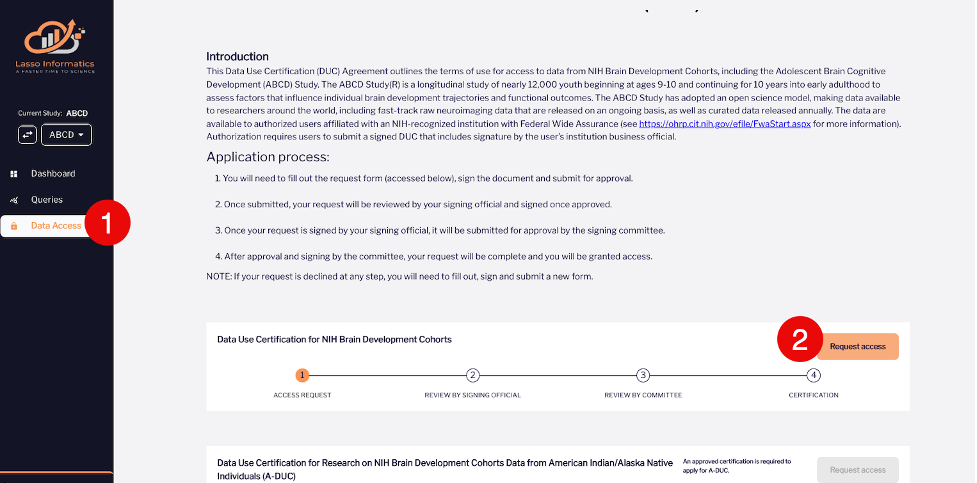

# How To Access HBCD Data
Public access to release data is conducted through the [NIH Brain Development Cohort (NBCD) portal supported by Lasso](https://nbdc-hbcd-beta.lassoinformatics.com), enabling seamless data queries, downloads, and sharing. Once you have an account and have logged into the Lasso Informatics platform, please follow these steps to request access to the data.

## Submit Data Use Certification form

Select **Data Access** from the left-hand menu followed by **Request access** in the lower right-hand corner of the page that appears:

This will bring you to the **Data Use Certification (DUC)** form. Fill out each of the sections as follows:

<u>Lead Recipient</u>

In this form you will provide information for all required fields, marked with an asterisk ( * ), including Name, Degree, Institution, and Address. Once complete, select **Continue** (lower right-hand corner of the page).

<u>Research Data Use Statement</u>

This form asks you to describe (within a limit of 250 words) why you need access to the dataset. Once complete, select **Continue** (lower right-hand corner of the page).

<u>Authorized Institutional Business Official</u>

Provide the name and email address of the Institutional Signing Official for your institution who will be authorizing your access and has signing authority. All fields in this form are mandatory. Once complete, select **Submit** in the lower right-hand corner of the page followed by **Continue Signing**. The next section outlines how to electronically sign the DUC.

## Sign DUC Electronically
This section of the DUC process asks you to agree to electronically signing the DUC. If you wish to proceed with signing, follow these steps.

<ol>
    

    <li>First select the Electronic records and signature agreement checkbox, which will enable the <b>CONTINUE</b> button - click this </li>
    

    

    <li>You will now see the form that requires your signature. Read through the contract and select <b>START</b> once you are ready to apply your electronic signature: </li>
    

    

    <li>Input your full name and initials in the fields of the following <i>Adopt Your Signature</i> dialogue box that appears: </li>
    

    

    <li>Select <b>ADOPT AND SIGN</b> to apply the signature to the document signature page.</li>
    

    

    <li>Select <b>FINISH</b> in the upper right-hand corner of the page to submit the signed document.</li>
    

    

    <li>Wait for the Signing Official to review and sign the DocuSign document.</li>
    

</ol>

## Instructions for Signing Officials
The Signing Official will receive an email from DocuSign asking that they review and sign the DocuSign document. The Signing Official must sign the document for the DUC process to continue as follows: 

<ol>
    <li>Open the email received from Lasso Informatics via DocuSign.</li>
    <li>Select <b>REVIEW DOCUMENT</b></li>
    <li>Select the Electronic Record and Signature Disclosure checkbox. <b>REMINDER: The checkbox must be selected in order to enable the CONTINUE button.</b></li>
    <li>Select <b>CONTINUE</b>.</li>
    <li>Select <b>START</b>.</li>
    <li>Review the document.</li>    
    <li>Sign the document to approve or, if you choose to decline to sign, select <b>Decline to Sign</b> from <b>OTHER ACTIONS</b> drop-down list in the upper right-hand corner of page.</li> 
    <li>Select <b>FINISH</b>.</li>     
    <li>Wait for the DUC committee (NIDA) to approve the request.</li> 
</ol>

## Review
This is the step where the DUC committee (NIDA) reviews your request. When your request is approved, you will receive an email notifying you of the approval. After signing in to the platform, you will have access to the requested data. If your DUC request is denied, your access to the platform will be limited, but you will be allowed to submit a new DUC request.

Please note: For beta testing, users do not have to undergo any additional training. But for the public release, each user needs to go through a mandatory training on responsible data use before accessing the data.  
