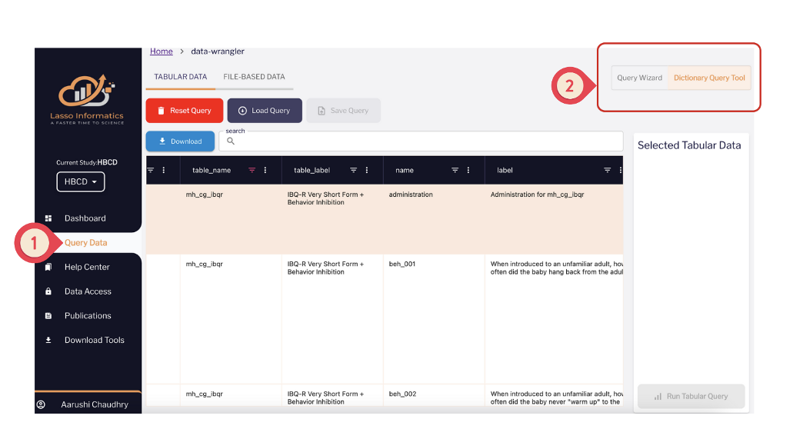
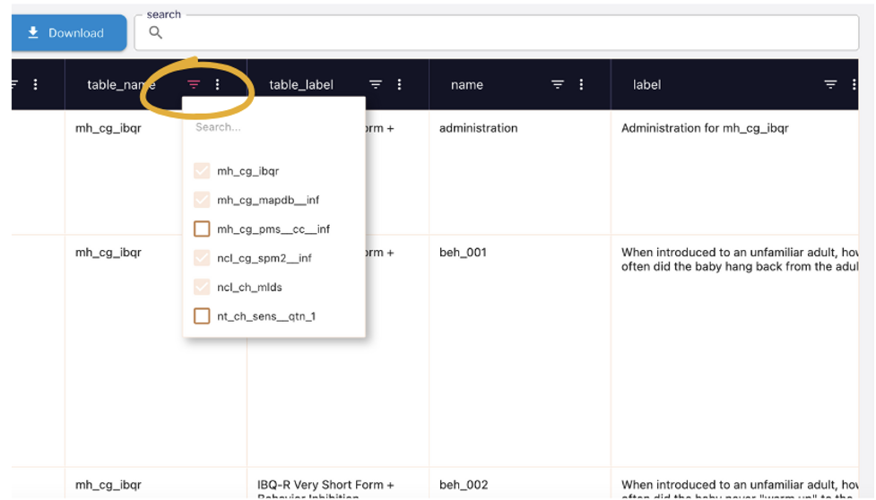
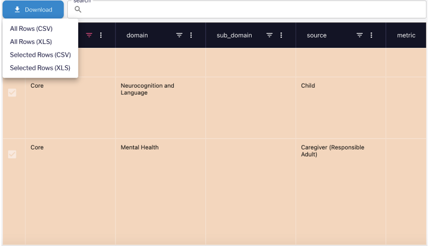
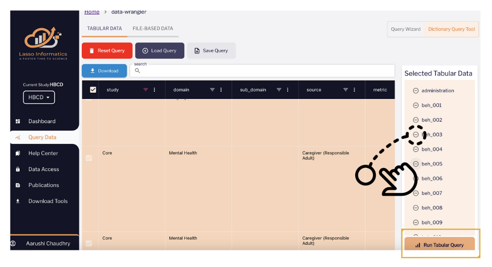
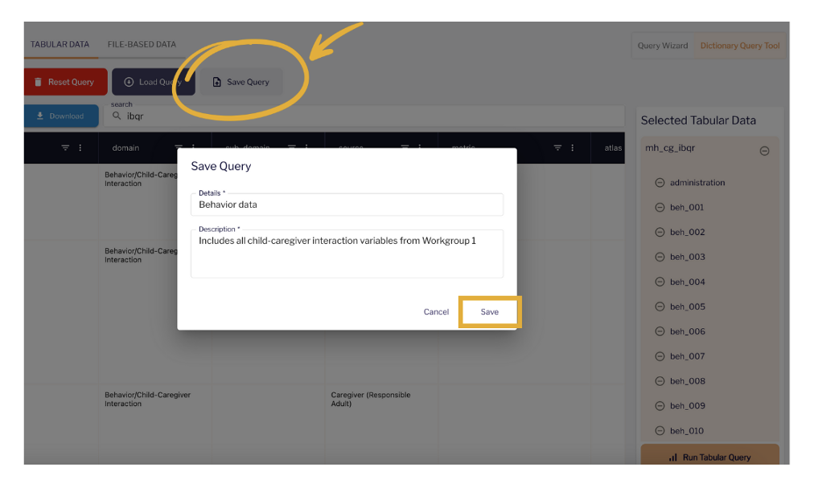

# Dictionary Query Tool

  <i class="fas fa-exclamation-triangle"></i>
  Instruction metadata - Caution, please read carefully:
  ▸

 

The text added to the 'instruction' column in the Data Dictionary metadata are extracted programmatically from the latest instruction field provided in the Data Dictionary of the form based on the order of the fields, and added to all fields up to the next set of instructions. Because of this, in some cases the instruction text may be broken into several instruction fields, of which only the last portion will currently be extracted, leading to partial instruction text. Likewise, since the instruction is provided for all fields up to the next set of instructions, in some cases the instruction provided may correspond to a previous section in the form. Instruction metadata will be fine-tuned manually for future releases. To ensure instructions are accurately interpreted, please refer to the original form.
 

  <a class="button-link" href="https://nbdc-splash-beta.lassoinformatics.com/hbcd-study">HBCD Study on NBDC Data Hub &nbsp; ↗️</a>

*Below we describe how to use the Dictionary Query Tool on the Lasso platform to download data.*

**Step 1: Get Started with Approved Access**  
Once your **Data Use Certification** has been approved and you’ve completed the required training, you’ll gain access to the **Query Data** tab in Lasso. This tab is conveniently located in the **left-hand side menu**.

**Step 2: Choose Your Query Method**  
On the Query Data page, you can toggle between the **Query Wizard** and the **Dictionary Query Tool**. Both tools offer flexible ways to build your queries, letting you choose the approach that best suits your needs.

**Step 3: Navigate the Dictionary Query Tool**  
When using the Dictionary Query Tool, you can filter data based on specific instruments or variables. Use the **column filters** or the **global search** to find exactly what you need quickly and efficiently.

**Step 4: Export the Data Dictionary**  
After selecting the desired fields, click on **Download** and choose your preferred export format for the data dictionary.

**Step 5: Query the Associated Data**

If you need both the data dictionary and the associated data:

* Drag and drop the selected fields into the **Selected Tabular Data** area.  
* Click on **Run Tabular Query**, and the system will generate and download the output file directly to your device in seconds.

**Step 6: Save and Reuse Your Queries**  
To save time on future queries, click the **Save Query** button. Your saved queries can be accessed later via the **Load Query** button. Select your saved query, click **Run**, and instantly download the most up-to-date data.

